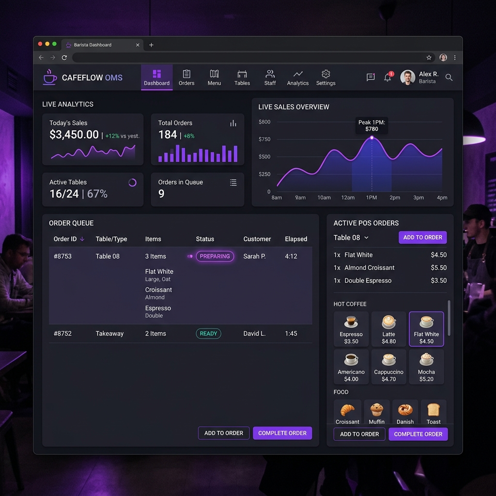

# Muhammad Danisy Hazwan - Personal Portfolio

A sleek, responsive, modern personal portfolio website built for **Muhammad Danisy Hazwan**, IT Student at Universiti Kuala Lumpur (UniKL) specializing in Back-End Development (ASP.NET, Java, C#) and Data Automation.



## 🚀 Features

- **Modern Glassmorphic Dark UI**: Custom ambient gradients, backdrop blur panels, and responsive layout built with Tailwind CSS.
- **Fixed & Refined Content**: Cleaned up bio text, corrected stray formatting brackets, and expanded skills & education sections.
- **Interactive Project Showcases**: Case study modal popups with technical breakdowns and GitHub links.
- **Dynamic Projects Filter**: Filter by Web Systems or Data Automation projects.
- **Interactive Features**: Copy-to-clipboard email button with custom toast notifications and interactive contact form feedback.
- **Media & Asset Integration**: Pre-bundled avatar and custom dashboard showcase mockups.
- **GitHub Pages Ready**: Zero build steps required—uses HTML5, Tailwind CDN, and FontAwesome icons out-of-the-box.

---

## 🛠️ Tech Stack

- **HTML5 & Vanilla JS**
- **Tailwind CSS** (via CDN)
- **FontAwesome 6** (Icons)
- **Google Fonts** (Plus Jakarta Sans & JetBrains Mono)

---

## 💻 How to Deploy on GitHub Pages

1. **Commit and push** all files (`index.html`, `assets/`, `README.md`) to your GitHub repository: `InvictusPRIMAL/InvictusPRIMAL.github.io` (or your portfolio repository).
```bash
git add .
git commit -m "Upgrade portfolio with modern UI, generated assets, and fixed content"
git push origin main
```

2. **Enable GitHub Pages**:
   - Go to your repository on GitHub (`https://github.com/InvictusPRIMAL/InvictusPRIMAL.github.io`).
   - Click **Settings** > **Pages**.
   - Under **Build and deployment** -> **Source**, select `Deploy from a branch`.
   - Choose `main` branch and `/ (root)` folder, then click **Save**.

3. Your website will be live in a few moments at:
   `https://invictusprimal.github.io/`

---

© 2026 Muhammad Danisy Hazwan. All rights reserved.
